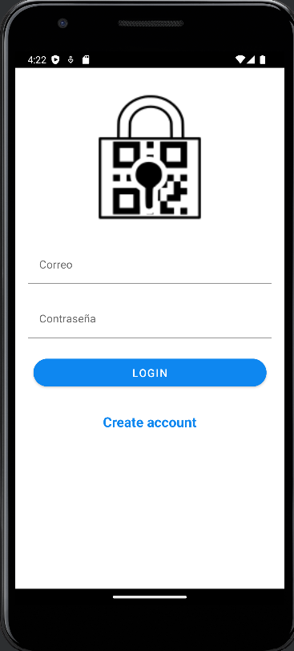
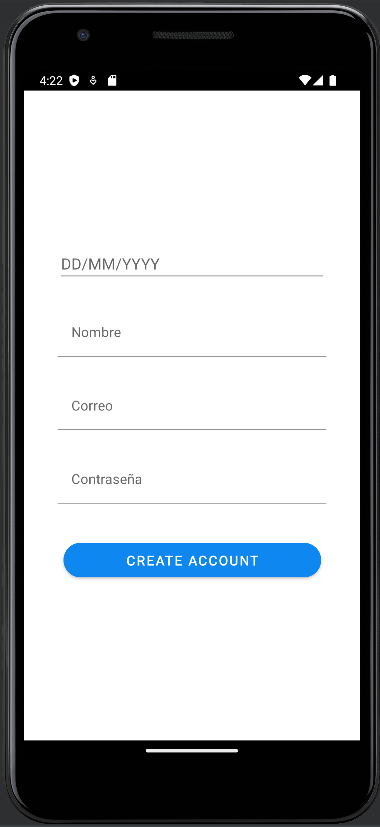
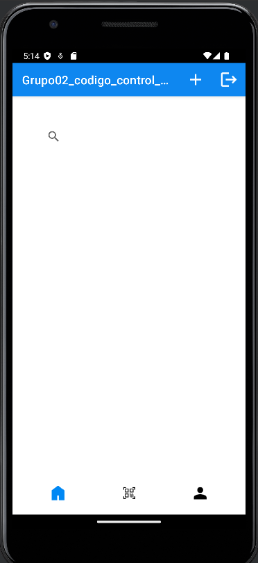
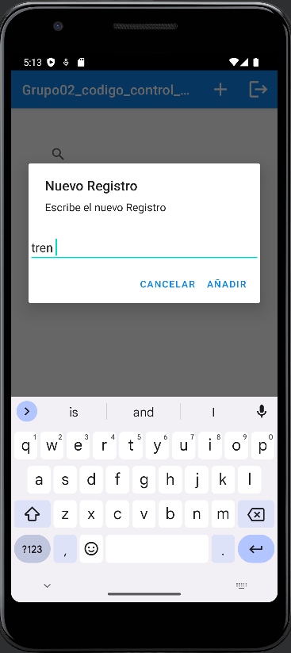
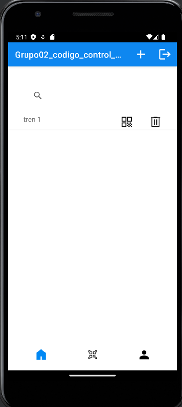
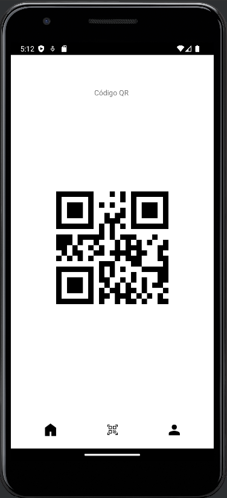
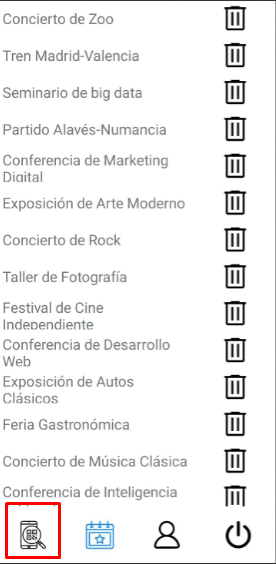
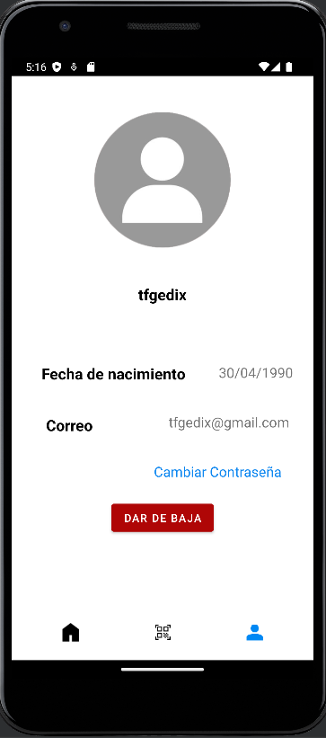

# Guía de funcionamiento de la app

## ¿Cómo funciona la app?

La aplicación es simple de utilizar e intuitiva ya se conforma de pocas pantallas y están bastante bien diseñadas.

Nada mas entrar en la aplicación nos sale la siguiente pestaña

---

### Login

<table>
	<tbody>
		<tr>
			<td width="600">Aquí podemos acceder con nuestra cuenta en caso de tener una de lo contrario tendremos que crearla.</td>
			<td></td>
		</tr>
	</tbody>
</table>

### Create Account

<table>
	<tbody>
		<tr>
			<td width="600">En caso de no tener una cuenta tendremos que completar los siguientes campos para darnos de alta.</td>
			<td></td>
		</tr>
	</tbody>
</table>

### Main

Al insertar el usuario accederemos a esta pestaña aquí podemos añadir registros y buscarlos por su nombre.

|       |         |
|:-------------:|:---------------:|

Además cuando tenemos un registro podemos borrarlo o generar un QR de este

|       |         |
|:-------------:|:---------------:|

### Scanner

<table>
	<tbody>
		<tr>
			<td width="600">La ventana de scanner nos permite comprobar que el QR que estamos escaneando se localiza en nuestra base de datos, en cualquiera de los casos nos notificara la app.</td>
			<td></td>
		</tr>
	</tbody>
</table>

### Perfil

<table>
	<tbody>
		<tr>
			<td width="600">Por ultimo la ventana del perfil nos permite ver los datos del usuario y además podemos cambiar la contraseña y dar de baja el usuario.</td>
			<td></td>
		</tr>
	</tbody>
</table>
