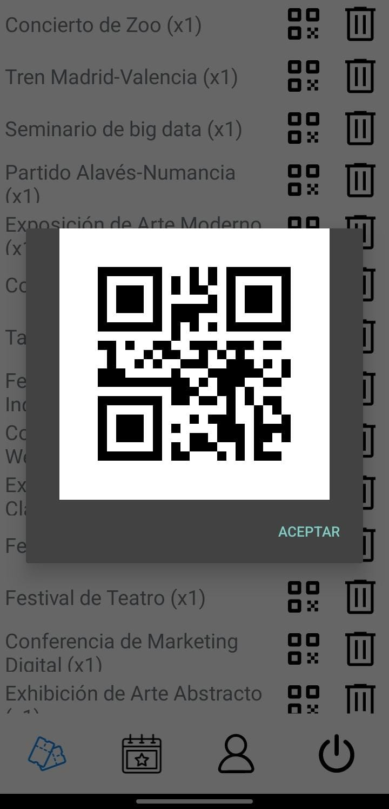

# Guía de funcionamiento de la app

## ¿Cómo funciona la app?

La aplicación es simple de utilizar e intuitiva ya se conforma de pocas pantallas y están bastante bien diseñadas.

Nada mas entrar en la aplicación nos sale la siguiente pestaña

---

### Login

<table>
	<tbody>
		<tr>
			<td width="600">Aquí podemos acceder con nuestra cuenta en caso de tener una de lo contrario tendremos que crearla.</td>
			<td></td>
		</tr>
	</tbody>
</table>

### Create Account

<table>
	<tbody>
		<tr>
			<td width="600">En caso de no tener una cuenta tendremos que completar los siguientes campos para darnos de alta.   En la version final no aparecera la opción para darse de alta como administrador ya que estos usuarios solo los podriamos crear nosotros</td>
			<td></td>
		</tr>
	</tbody>
</table>

### Main
<table>
	<tbody>
		<tr>
			<td width="600">Al insertar el usuario accederemos a esta pestaña aquí podemos ver la lista de eventos que tiene nuestro usuario, podemos generar el qr o eliminarlos, en caso de no tener tendremos que agregarlos.</td>
			<td></td>
		</tr>
	</tbody>
</table>

### Lista de eventos

<table>
	<tbody>
		<tr>
			<td colspan="2">En esta ventana añadimos los eventos a los que queramos asistir.</td>
		</tr>
		<tr>
			<td></td>
			<td></td>
		</tr>
	</tbody>
</table>

### Scanner

<table>
	<tbody>
		<tr>
			<td width="600">La ventana de scanner nos permite comprobar que el QR que estamos escaneando se localiza en nuestra base de datos, en cualquiera de los casos nos notificara la app.</td>
			<td></td>
		</tr>
	</tbody>
</table>

### Perfil

<table>
	<tbody>
		<tr>
			<td width="600">Por ultimo la ventana del perfil nos permite ver los datos del usuario y además podemos cambiar la contraseña.</td>
			<td></td>
		</tr>
	</tbody>
</table>
